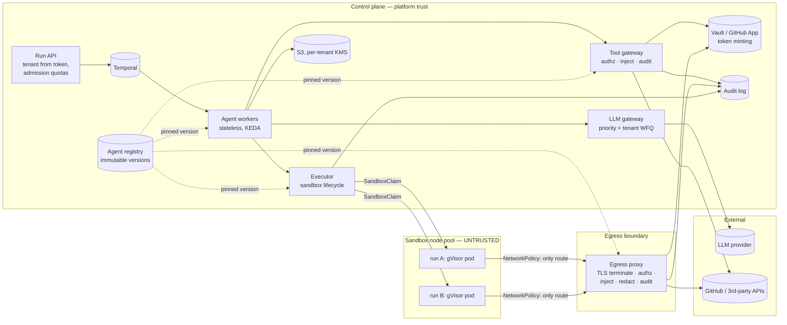
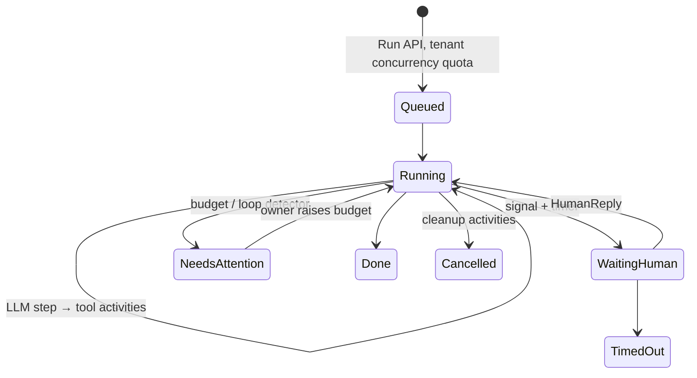
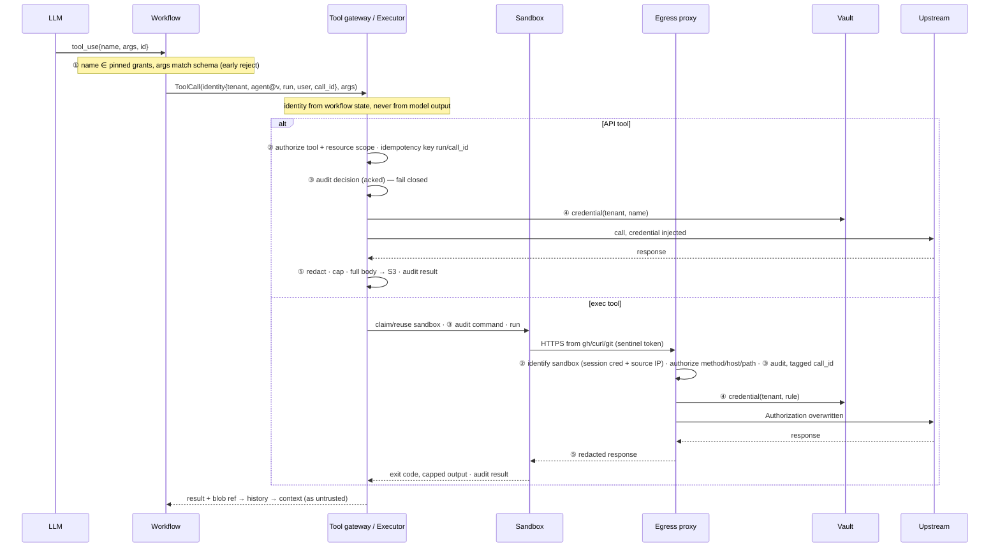

# agentfleet — design

**In one paragraph.** An agent run is a **durable Temporal workflow**, not a pod. Stateless Go workers replay it, so a run waiting two days for a human costs a few rows. Code runs in a **per-run gVisor sandbox**, claimed from a warm pool on the run's first exec call and hibernated when idle. A sandbox's only network path is an **egress proxy that holds the tenant's credentials**. The proxy authorizes each request against the agent's pinned definition, injects the credential and redacts it from responses. API tools go through a **tool gateway** built on the same policy code. Every action is audited, attributed to tenant, agent, run, user and tool call, *before* it takes effect, in a hash-chained log. LLM capacity is shared by a gateway doing priority classes plus per-tenant weighted fair queuing.

| Stated choice | |
|---|---|
| Language / runtime | Go for all platform services and the agent loop (Temporal Go SDK); Python, Node and Bash exist only inside sandboxes |
| Workflow engine | Temporal (Postgres at 1×; Cassandra or Temporal Cloud at 10×) |
| Sandbox | gVisor RuntimeClass on a tainted node pool, managed through the Agent Sandbox CRDs (`SandboxClaim`, `SandboxWarmPool`); Kata on bare metal as an opt-in isolated tier |
| State | Temporal history holds refs; payloads in S3 (claim-check, per-tenant KMS); registry and idempotency in Postgres; audit to Kafka → ClickHouse + S3 Object Lock |
| Agent definition | Immutable `tenant/name@vN` (model, prompt, tool grants, egress rules, limits, budgets; see `agents/`). Aliases for rollout. **A run is pinned to one version for its whole life.** |

Assumptions: one cluster per region at 1×, cells at 10×; prompts and tool outputs are hostile; tenants trust the platform, not each other.

## 1. System diagram

**Where tenant isolation is enforced:**
1. **Run API:** the tenant comes from the auth token, never from the payload.
2. **Gateway and proxy:** credentials are looked up only by *(the run's tenant, name)*; nothing can name another tenant's credential.
3. **Sandbox:** one pod per run, never reused; NetworkPolicy keyed on run labels; optional per-tenant node pools.
4. **Storage:** per-tenant S3 prefix and KMS key.
5. **TLS:** one interception CA per tenant.

## 2. Agent lifecycle

**At runtime an agent is a Temporal workflow execution**, meaning an event history plus blobs. It occupies worker memory only while a step is executing.

- **Start.** Resolve alias → version; runs over the tenant's concurrency quota queue rather than fail; `StartWorkflow(id=tenant/run)` is idempotent.
- **Placement.** Shared task queues per priority class; the isolated tier gets its own queues and workers. Workers scale with KEDA on schedule-to-start lag. Sandboxes reach the sandbox pool through `SandboxClaim`.
- **Loop.** `LLMStep` (via the LLM gateway), then a `ToolCall(identity, call_id)` activity per tool call, with budgets checked every step.
  - Payloads over 2 KB go to S3 by reference. This is mandatory: Temporal's hard limit is 51,200 events / 50 MB, and a 100k-token context passed inline fills 50 MB in about 100 turns.
  - `Continue-As-New` every 500 turns.
- **Waiting for a human.** The workflow awaits a signal with a timer and drops out of the sticky cache. After 10 idle minutes the sandbox hibernates (workspace to S3, pod deleted); the next exec call rehydrates it.
- **Timeout and cancellation.** Hard run timeout plus per-activity heartbeat and start-to-close timeouts. Cancellation runs cleanup in a disconnected context (kill processes, release the sandbox, revoke minted tokens); `Terminate` skips it, and a label-based reaper sweeps up.
- **Deploys.** Worker Versioning keeps each run on the build that started it. CI replays sampled production histories.

**Position: stateless workers replaying a log, not a process per agent.** Agents mostly wait. A process per agent pays for waiting in memory, dies on every drain, and ends up re-implementing checkpoints.
- *Reverse* if agents hold in-memory state that is costly to rebuild (a 10 GB notebook kernel), or need under 10 ms of overhead per step. Then actors with snapshots, or Restate.

**Position: a scheduler on Temporal, not Kubernetes Jobs/CRDs per run.** At 10× (~1,700 tool calls/s), objects per run or per call put etcd on the hot path, with no signals, timers or replay. Kubernetes runs the *fleet*: Deployments + KEDA, the Agent Sandbox CRDs, RuntimeClass, NetworkPolicy, PodDisruptionBudgets.
- *Reverse* for a few dozen heavy, long-lived agents (GPU jobs), where `kubectl get agentruns` transparency beats throughput.

## 3. Tool call path

**Who sees what:** the model sees granted schemas, its own arguments and redacted results. The worker sees identities and references. The sandbox sees its workspace, sentinel tokens and its tenant CA's *public* cert. Only the gateway and proxy ever hold a credential, only for the run's tenant, only at request time.

**Position: enforce authorization at the gateway and the proxy. Grants in the schema are a hint to the model, not a control.**
- The schema reduces hallucinated calls and tokens, but an injected model can emit anything.
- Authorization at the tool is rejected: third-party tools can't be trusted with it, and the policy would scatter.
- The proxy is the second enforcement point because `curl` inside a sandbox never passes through a tool gateway.
- Both use `internal/policy`.
- *Reverse* when tools are first-party with fine-grained resource ACLs: keep coarse grants at the gateway and push resource checks to the tool.

## 4. Sandbox design

- **Technology: gVisor.** A user-space kernel shrinks the host-kernel attack surface. It runs on ordinary cloud VMs (no `/dev/kvm`), starts as a process (no guest boot), and costs tens of MB.
  - Rejected: seccomp-only containers (a shared kernel means one CVE is a cross-tenant breach), WebAssembly (can't run pandoc, gh or git), shared executor pools (state residue between runs).
  - Kata/Firecracker give a stronger boundary but need bare metal or nested virtualization, so they are the opt-in isolated tier. Reversal: §7.
- **Filesystem.** Read-only, digest-pinned image. `/workspace` is an emptyDir with a size limit, plus a small `/tmp`. No service-account token, no hostPath, non-root, all capabilities dropped, `no-new-privileges`.
- **Network.** Default-deny NetworkPolicy; the only egress is the proxy on :3128, with no DNS. The proxy resolves names itself, refuses link-local, loopback and CGNAT addresses (private ranges too, unless the host is registered internal), and dials the exact address it checked, so DNS rebinding has no window. Plaintext, IP literals and ports other than 443 are refused.
- **How `gh` gets a token without reading it.**
  1. The env holds only `GH_TOKEN=af-sentinel-…`.
  2. `gh` honours `HTTPS_PROXY` and `SSL_CERT_FILE`, so it reaches the proxy, which terminates TLS with the tenant's CA.
  3. The proxy *overwrites* `Authorization` with a GitHub App installation token narrowed to the grant (TTL ≤1 h, cached).
  4. Responses are scrubbed of every credential value. The proxy drops `Accept-Encoding` so the body is inspectable, and fails closed on encodings it can't read.
  - `git` over HTTPS works the same way; SSH fails closed.
  - Grants are method- and path-scoped because host-level injection would still let an injected agent file issues in an attacker's repo.
- **Limits.** CPU, memory (swap = memory), pids, workspace size, a per-command wall clock *plus* an outer kill-all guard (a detached child can hold stdout open past `timeout`), 64 KB of output to the model with the rest to S3, and a per-run budget of sandbox-seconds.
- **Cold start, measured in the PoC** (runc, no pool, 2 vCPUs): **420 ms p50 one at a time; 4.3 s p50 with 20 at once**, mostly per-sandbox network setup. That part is a Docker artefact (NetworkPolicy is label-based); the rest is why the warm pool is mandatory. Target: ~200 ms p90 claims from `SandboxWarmPool`, pre-scaled before the 9 a.m. burst (KEDA cron from tenant history), with per-tenant claim-rate limits.
- **When compromised.** Containment layers: gVisor sentry → seccomp on the sentry → a secret-free dedicated node → sandbox nodes that reach only the proxy → per-tenant nodes (isolated tier). Detected by proxy deny spikes and gVisor/Falco alerts. Response: kill the sandbox, quarantine the run, revoke its minted tokens, cordon and replace the node on a suspected host escape, keep the snapshot, notify the tenant.

## 5. Scaling and cost

Baseline: 1,000 runs, ~170 tool calls/s, ~40% of runs holding a sandbox.

| | 1× | 10× |
|---|---|---|
| Temporal | ~1–2k transitions/s, Postgres | ~15–20k/s, Cassandra or Temporal Cloud. **Set `numHistoryShards=4096` now (immutable).** |
| Workers (I/O-bound) | ~300 runs per pod → 4–6 pods | ~50 pods or cells |
| Gateway / proxy | 3 pods each; PoC proxy **2 ms p50 / 7 ms p99** including two fsynced audit writes | ~10 pods each; Kafka `acks=all` instead of fsync |
| Sandboxes | ~400 at 0.25 vCPU / 512 Mi request → 8–10 nodes of 32 vCPU / 128 GiB, plus a 10% pool | ~4k, 80–100 nodes across cells |

- **Per run:** history, sandbox (only while executing), workspace blob, minted tokens. Everything else is shared. **Idle cost ≈ 0:** a run waiting on a human has no pod, no worker memory and no sandbox.
- **Sharing the LLM fairly.**
  1. **Strict priority** across classes: P0 human-blocking > P1 agent steps > P2 batch.
  2. **Per-tenant weighted fair queuing** within a class (deficit round-robin on estimated tokens, weights by plan). It is work-conserving: idle capacity goes to whoever is waiting.
  3. **Reserve, then reconcile:** reserve prompt + `max_tokens` before the call; reconcile with actual usage after.
  4. **Adapt to provider 429s** by lowering estimated capacity (AIMD).
  5. **Backpressure:** queue up to the request's deadline, then return `RESOURCE_EXHAUSTED`. Temporal retries with jitter, and the waiting run holds nothing.
  6. **Cost controls:** stable prompt prefixes for provider caching; per-tenant $/day caps.
  - *Reverse to hard partitions* for tenants sold reserved capacity.

## 6. Failure modes

| Failure | Detection | Recovery |
|---|---|---|
| **Node lost mid-tool-call** | Heartbeat or start-to-close timeout; executor sees the pod gone | **API tool:** retry with idempotency key `run/call_id`; the dedupe table returns the recorded outcome. If the outcome is unknown and the tool isn't idempotent, tell the model "may have happened, check first". **Exec tool:** never re-run a shell command automatically. Claim a fresh sandbox, restore the last snapshot, and report "interrupted, workspace at step k". The audit shows `exec` without `exec_result`. |
| **Poison agent looping** | Budgets (steps, calls/min, tokens, $, wall time); loop detector (same `(tool,args)` hash ≥5 of the last 20); per-run deny rate | Pause as `NeedsAttention` (inspectable, resumable). If N runs of one version trip, open a circuit breaker on that version and page the owner. |
| **LLM 429 storm or outage** | Error rate, queue-wait p99 | Shed P2 first, protect P0; AIMD; secondary model if the definition allows. Runs wait durably, with no retry storm. |
| **Non-deterministic deploy** | CI replay; Temporal non-determinism metrics | Worker Versioning: in-flight runs stay on the old build; rollback re-points the default. |
| **Audit pipeline down** | Write errors | **Fail closed:** no new effects, runs wait (implemented in the PoC). Reverse only with a bounded, fsynced local spool. |
| **Proxy or executor restart** | Health checks | Stateless: the identity map is rebuilt from `SandboxClaim`s and activities retry (the PoC sweeps orphans by label). |
| **One tenant's 9 a.m. burst** | Claim queue depth | Per-tenant run and sandbox quotas queue the excess; scheduled pool and node pre-scaling. |

## 7. The three hardest decisions

1. **Run = Temporal workflow on stateless workers.** Rejected: a pod or process per agent (§2); my own Postgres event log (I would rebuild timers, signals and visibility); Restate (better per-step latency, less operating history at the level auditors probe). Price: claim-check plumbing, Continue-As-New, determinism discipline. *Reverse:* §2.
2. **One warm sandbox per run, hibernated when idle, on gVisor.** Rejected: per-call ephemeral sandboxes, which are cleaner but break clone → test → fix loops, and 10× needs ~1,700 claims/s against a published ~300/s per cluster. Price: a run compromised early stays compromised for its lifetime. *Reverse* to per-call when exec calls are one-shot conversions. *Reverse* to Kata on bare metal when compliance requires hardware isolation, or when syscall-heavy builds make gVisor's I/O overhead dearer than VM memory.
3. **TLS interception so credentials never enter the sandbox.** Rejected: a short-lived scoped token *inside* the sandbox plus CONNECT-only allow-listing. That is simpler and keeps end-to-end TLS, but the model can read the token and exfiltrate it via any *allowed* host, for example by pasting it into an issue body. Price: per-tenant CAs, pinning CLIs fail closed, a high-value proxy. *Reverse* when tokens can be per-call, minute-TTL and single-resource, *and* a tenant requires end-to-end TLS.

## 8. What I cut

- **Data exfiltration to *allowed* destinations:** bounded by path scoping, rate limits and audit, not prevented.
- **Prompt-injection defences** beyond capability limits: classifiers, and approval gates (a "needs approval" policy outcome turned into a workflow signal).
- **Delegated grants** between agents.
- **Operations:** multi-region, DR, CA and secret rotation, image signing, billing, UI.

None of these changes the shape of the components above, and each has an obvious extension point. Credential containment and cheap durable waiting *do* change the shape, so that is where the time went.
